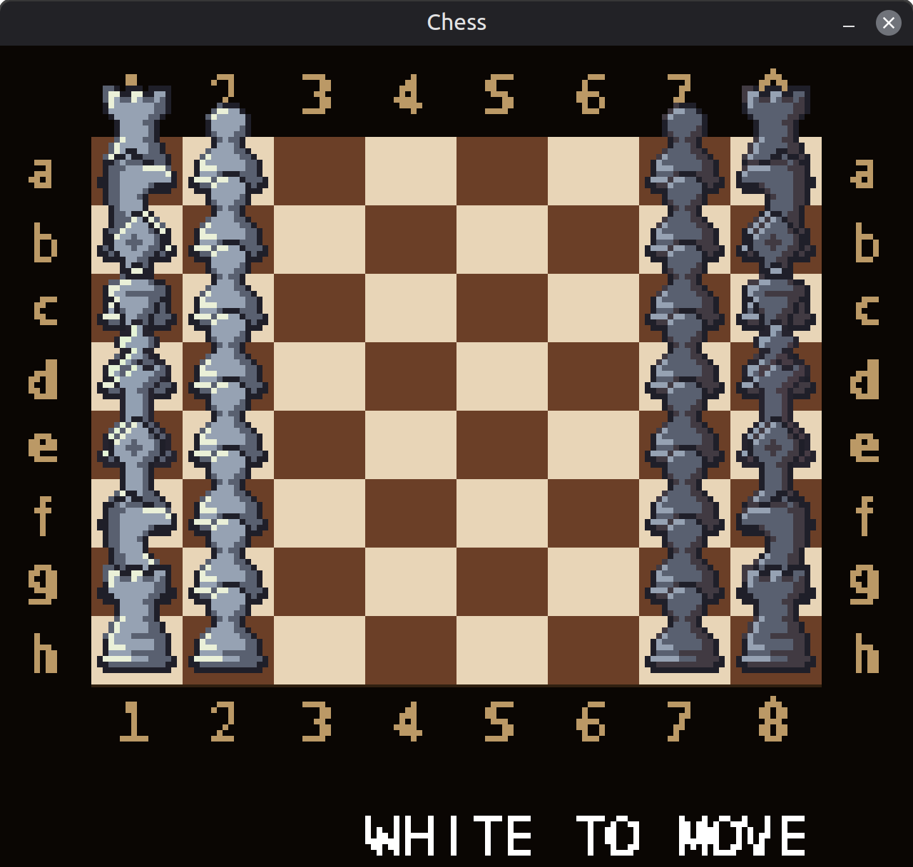
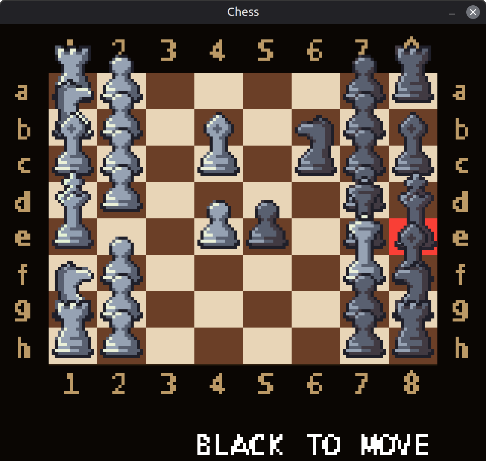
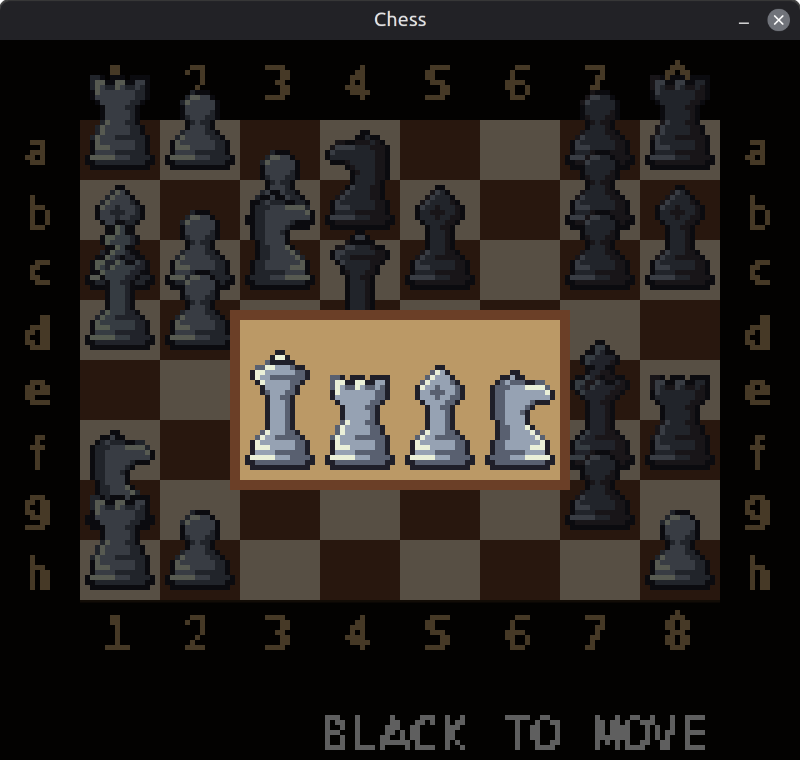

<div align="center">

# ♟ Pixelchess

**A pixel-art chess engine and GUI built with Python and pygame.**

Pure legal-move generation · Drag-and-drop input · Animated pieces · Particle effects

[](https://www.python.org/)
[](https://www.pygame.org/)
[](LICENSE)
[](https://github.com/AleCatt/pixelchess/actions/workflows/ci.yml)

<br>


</div>

---

## Features

- **Full rule set** — legal move generation with check filtering, castling, en passant, and pawn promotion
- **2.5D pixel-art board** — foreshortened perspective achieved with pure rectangle scaling, no projection math
- **Drag-and-drop input** — click-to-select or drag pieces; illegal drops play a sound and snap back
- **Piece animation** — quadratic ease-out interpolation between squares
- **Check tremor** — the king shakes with independent sine waves on each axis when in check
- **Capture particles** — burst of colour-matched debris on every capture
- **Bitmap font rendering** — custom sprite-sheet font, no system fonts required

---

## Screenshots

| Opening position | Check | Promotion menu |
|:---:|:---:|:---:|
|  |  |  |

---

## Getting started

### Prerequisites

- Python 3.11 or newer
- [pygame](https://www.pygame.org/) 2.x

### Installation

```bash
git clone https://github.com/AleCatt/pixelchess.git
cd pixelchess
pip install -r requirements.txt
python main.py
```

### Controls

| Action | Input |
|---|---|
| Select piece | Left-click |
| Move piece | Click destination **or** drag and drop |
| Restart game | Click anywhere after game over |
| Quit | `Esc` or close window |

---

## Project structure

```
pixelchess/
├── main.py                  # Entry point — pygame init and game loop
├── gui.py                   # ChessGUI — rendering and input handling
├── assets.py                # AssetManager — sprite, sound, and font loading
├── constants.py             # All layout constants, colours, and timing values
├── font.py                  # PixelFont — bitmap font renderer
├── particles.py             # ParticleSystem — capture burst effects
│
├── chess/
│   ├── engine.py            # ChessEngine — game state and rule enforcement
│   └── pieces.py            # Piece classes — movement rules only
│
├── assets/
│   ├── pieces/              # Sprite PNGs: {color}_{type}.png (e.g. white_queen.png)
│   ├── audio/               # Sound effects: move.mp3, capture.mp3, etc.
│   └── font/
│       └── font.png         # Bitmap font sprite sheet (ASCII printable, 16 cols)
│
├── tests/
│   ├── test_engine.py
│   └── test_pieces.py
│
├── docs/
│   └── images/              # Screenshots used in this README
│
├── .github/
│   ├── workflows/
│   │   └── ci.yml
│   └── ISSUE_TEMPLATE/
│       ├── bug_report.md
│       └── feature_request.md
│
├── requirements.txt
├── CHANGELOG.md
├── CONTRIBUTING.md
└── LICENSE
```

---

## Architecture

The codebase is split into two layers with a hard boundary between them.

```
┌─────────────────────────────────────┐
│           GUI layer                 │
│  main.py · gui.py · particles.py   │
│  assets.py · font.py · constants.py│
└──────────────┬──────────────────────┘
               │  calls
┌──────────────▼──────────────────────┐
│          Chess layer                │
│   chess/engine.py · chess/pieces.py│
│   (no pygame imports)               │
└─────────────────────────────────────┘
```

**`chess/engine.py`** owns all mutable game state: board grid, turn, castling rights, en passant target, and promotion status. It exposes three primary methods to the GUI:

```python
engine.get_legal_moves(row, col)   # → list of (row, col)
engine.move_piece(start, end)      # → {"promotion_required": bool, ...}
engine.promote_pawn(row, col, type)
```

**`chess/pieces.py`** contains only movement rules. Pieces read board state through the engine but never mutate it. Each piece implements a single method:

```python
piece.get_moves(engine, row, col)  # → pseudo-legal list of (row, col)
```

Legal move filtering (check detection) lives in the engine, not the pieces.

---

## Asset format

### Piece sprites

PNGs named `{color}_{type}.png` inside `assets/pieces/`. Expected dimensions: **16 × 32 px** source (upscaled 8× at runtime to 128 × 256 px). The extra height above 16 px lets pieces bleed upward for a 2.5D silhouette.

Pieces that fail to load are replaced with a magenta rectangle so missing sprites are immediately obvious without crashing.

### Sound effects

MP3s inside `assets/audio/`. All sounds are optional — missing files are silently skipped.

| File | Trigger |
|---|---|
| `move.mp3` | Quiet piece move |
| `capture.mp3` | Any capture (including en passant) |
| `check.mp3` | Opponent's king enters check |
| `castle.mp3` | Castling move |
| `promote.mp3` | Pawn promotion confirmed |
| `illegal.mp3` | Piece dropped on invalid square |
| `game-start.mp3` | Board reset |
| `game-end.mp3` | Checkmate or stalemate |

### Bitmap font

A single PNG sprite sheet at `assets/font/font.png`. Characters are monospaced, **6 × 8 px** per glyph in source, covering the ASCII printable range (0x20–0x7E) in a 16-column grid. Upscaled 8× at runtime.

---

## Running tests

```bash
pip install pytest
pytest tests/
```

---

## Contributing

Pull requests are welcome. Please read [CONTRIBUTING.md](CONTRIBUTING.md) before opening one.

---

## License

[MIT](LICENSE) — use it however you like.
